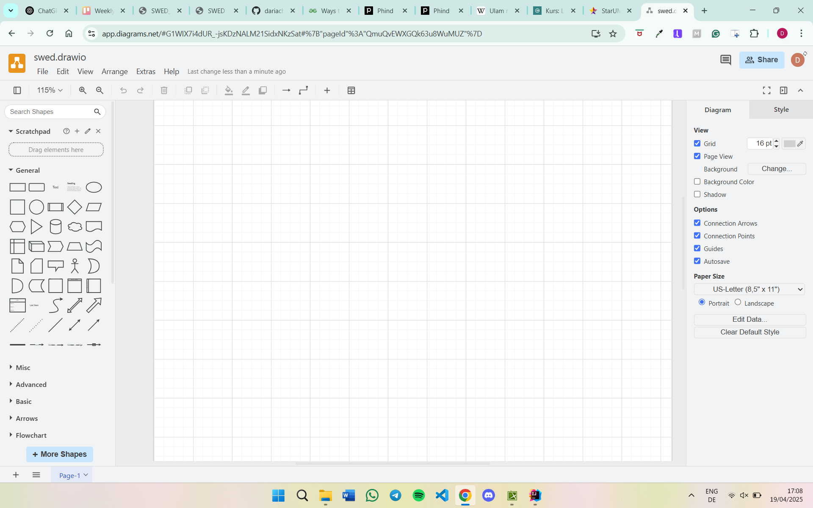
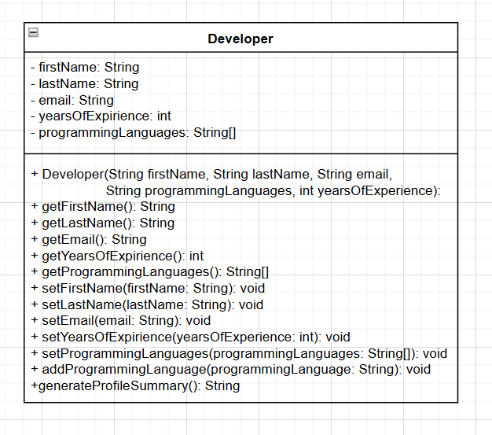

# Exercise 1
### 1. Please install an IDE (integrated development environment) of your choice on
   your computer and document this with a screenshot. Please name 10 advantages
   of an IDE compared to a simple text editor.

#### Advantages of an IDE compared:
   - Integrated Version Control: Many IDEs have Git integration, allowing you to easily commit changes, create branches, and manage versions directly from the interface.
   - IDEs help manage large projects by organizing files and folders into a structured workspace, improving navigation and efficiency.
   - Code Navigation: IDEs allow you to quickly jump to functions, classes, or methods, which makes navigating large codebases much easier.
   - Extensibility: IDEs support various plugins and extensions that can add functionalities such as additional language support, testing frameworks, or deployment tools.
   - Debugging Tools: Built-in debuggers help you test and troubleshoot your code by allowing you to step through, inspect variables, and set breakpoints.
   - Syntax Highlighting: IDEs color-code your code based on syntax, making it easier to read and identify issues quickly.
   - Code Autocompletion: IDEs offer code suggestions as you type, which speeds up development and reduces syntax errors.
   - Refactoring Support: IDEs provide tools for refactoring code, like renaming variables or functions across the entire project, without breaking the code.
   - Integrated Terminal: Most IDEs come with a built-in terminal for running scripts or commands directly from the development environment.
   - Unit Testing Support: Integrated testing frameworks within IDEs allow you to write, run, and debug unit tests directly from the development environment, streamlining the testing process.
   - Task Management Integration: Many IDEs integrate with project management tools (like Jira or Trello), enabling developers to track tasks and bugs directly within the IDE.
### 2. Prove that the Ulam function defined as
1. Start with a positive integer n.
2. If n is even, divide it by 2.
3. If n is odd, multiply it by 3 and add 1.
4. Repeat steps 2 and 3 with the resulting number.
   terminates with 1 for any given positive integer n<1M.

*Look Ulam.java file*

### 3. Create a gitHub.com account and commit your software to a new repository.
https://github.com/dariacherepina/Software-Engineering-Design-SoSe-25.git

### 4. Please install the MagicDraw UML Editor on your computer 

*I also have Magic Draw installed on my laptop, but I would rather work in drawio.*

### 5. Draw a UML class diagram for a class developer with at least 5 suitable attributes and 5 methods. 
Draw an object diagram with corresponding values for yourself. Implement this class in Java with integrity checks in the setter methods.

*Look into Developer.java file* 

### 6. Define the term software design. Explain how this differs from software analysis. 
The design phase of software development deals with transforming the customer requirements as described in the SRS documents into a form implementable using a programming language.
Software design describes how the software system is decomposed and organized into components and modules. It defines the relationship between these modules through interfaces. A good design makes the software understandable, modifiable, reliable and reusable.

#### Differences Between Software Design and Software Analysis:
**Focus**:
- Software Design: Focuses on HOW to implement the solution based on the requirements.
- Software Analysis: Focuses on understanding and specifying WHAT needs to be done.

**Phase in Software Development Life Cycle**:
- Software Design: Occurs after analysis, during the system design or development phase.
- Software Analysis: Occurs earlier in the development cycle, right after the requirements gathering phase.

**Objective**:
- Software Design: The objective is to define the ARCHITECTURE and solution to meet the requirements.
- Software Analysis: The objective is to understand the PROBLEM and ensure the software will fulfill the needs of the stakeholders.

**Output**:
- Software Design: Results in design documents, architectural diagrams, and detailed specifications of the system.
- Software Analysis: Results in requirement documents, use cases, and business logic definitions.

**Level of Abstraction**:
- Software Design: Focuses on both high-level and low-level abstractions, moving closer to actual code implementation.
- Software Analysis: Operates at a higher, more abstract level, concentrating on understanding and defining the problem space.
### 7. Explain why a software design is necessary for a software project. Can you think of a project without this step? What could be the consequences? 
- **Clear Structure and Organization**: A well-thought-out software design provides a blueprint for the entire system, outlining how different components and modules will interact. This structure ensures that the software is organized and easy to manage as it grows.

- **Risk Mitigation**: A good design helps identify potential risks early in the project (such as scalability, performance issues, or security vulnerabilities) and allows for proactive mitigation strategies. It provides a roadmap for developers, reducing the chances of errors that arise from poor planning.

- **Improved Maintainability**: Software that is well-designed is easier to maintain and update over time. A good design considers modularity, reusability, and clarity, which simplifies the process of adding new features, fixing bugs, and handling changes in requirements.

- **Efficiency in Development**: Having a design in place speeds up the development process by providing clear guidelines on how to implement features, test them, and integrate them. Developers don’t have to make critical architectural decisions as they go; they can focus on coding according to the plan.

- **Collaboration and Communication**: A design document or diagram helps developers, project managers, stakeholders, and other team members understand the project’s goals and progress. It fosters better collaboration, ensuring that everyone is aligned on the project’s architecture and objectives.

- **Consistency and Quality**: Design ensures that the software adheres to quality standards and best practices, such as modularity, simplicity, and scalability. It helps in maintaining consistency in coding style, system architecture, and design patterns, which is crucial for larger projects or teams.

- **User Experience (UX)**: A well-designed system accounts for user requirements and ensures that the software is user-friendly. Design decisions can have a significant impact on how intuitive and efficient the final product is for users.

### 8. Are the design activities of architectural design, database design, user interface design and component design independent or interdependent? Using an example, explain why. 

They are interdependent, mainly because they all have to be connected and work with each other to build a cohesive system.

Example:

**Library website (system)**:

**UI Design** specifies a product catalog where users can search for books, view details, and add items to their shopping cart.

**Database Design** involves creating tables for books, categories, users, and orders. It must ensure that product information (name, description, price, availability) is structured efficiently and can be retrieved based on search criteria like category or price range.

**Component Design** involves developing services and classes that handle business logic such as product searches, user authentication, and order placement. These components need to ensure that user input from the UI is validated and processed.

**Architectural Design** outlines how all these components interact. It specifies how the UI communicates with backend services (components) and how the backend services access and modify data in the database.

*In this example, if the UI design changes to include new product, the database design may need to be adjusted to include new field. The component design will need to be updated to handle these new item, and the architecture must ensure that the system remains scalable as new items are added.
It works the same way not matter what we add/delete/update the entire system need to be adjusted, in oder for it ot work -> which proves that the designs are interdependent.*