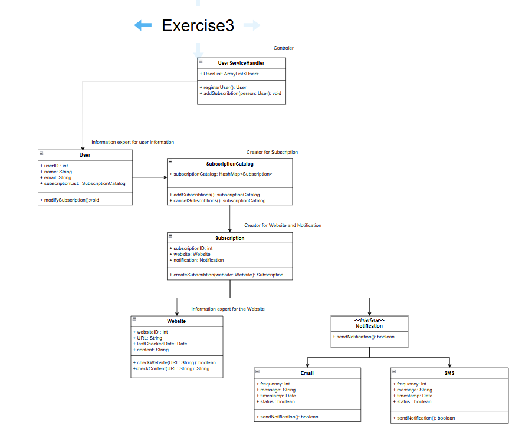
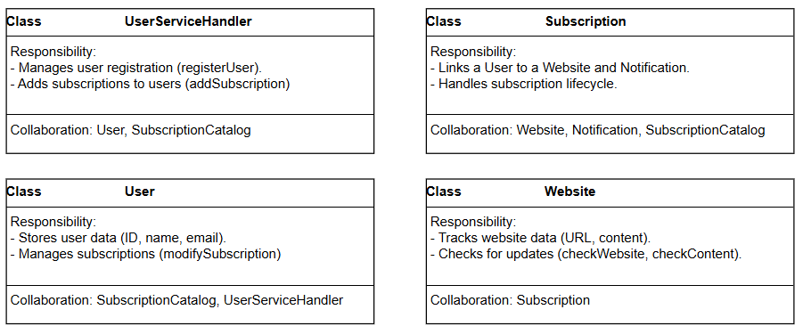
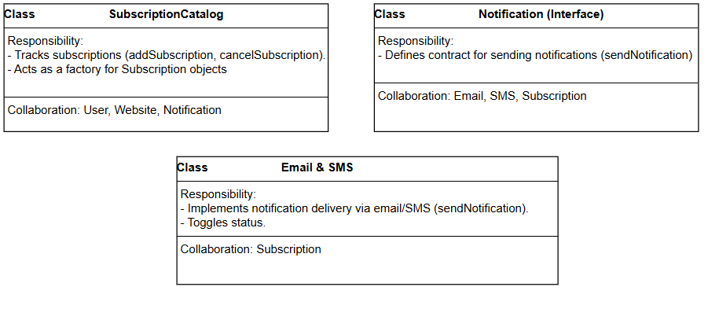

1. Given the following textual description, draw a structural UML design model for
   the software website monitor.

   The system allows ***users*** to register for **updates** on a specific **website**. Upon
   registration, users provide the **URL** of the website they wish to monitor and specify
   their **notification preferences**, such as **frequency** and **preferred communication
   channel**. The system then periodically checks the subscribed websites for updates.
   When an update is detected, the system generates a **notification** and delivers it to the
   user via their chosen communication channel. Users can also manage their **website
   subscriptions**, allowing them to modify or cancel existing subscriptions as needed.

Classes: 
   UserServices,
   User,
   Update,
   Website (URL),
   Notification (Preference, Frequency, Communication channel),
   Subscription

Methods:
   register
   provide URL
   monitor Website
   generates a notification
   delivers it

I as well uploaded class diagram to the drawio in google, where you can find it in a better resolution as screenshots here.

https://drive.google.com/file/d/1WIX7i4dUR_-jsKDzNALM21SidxNKzSat/view?usp=sharing

2. Read Aldrich - GRASP.pdf (see CampUAS). Describe how tho find the
   responsible class for a method. Describe how to find the responsible class for the
   creation of an object.

### Information expert:
Where to assign responsibilities to classes?

Assign responsibility to the class that has the information needed to fulfil it
#### Creator

Who creates instances of class A ?
Class B create objects of A if:
- B has initialising information for A
- B contains or compositely aggregates A
- B closely uses A
- B records A

#### Controller: 
an entity responsible for handling a system operation should be a separate
class. Controllers act as intermediaries between the user interface and the business
logic (see also MVC)

3. Create CRC cards for the classes designed in 1. Please reiterate your model and
   use the Controller and Expert principle. Did you change the responsibility for any
   of your methods? 

Yes, I indeed changed the responsibility for multiple methods, as for example: 
- registerUser(): User - before it was in User class
- addSubscribtions(): subscriptionCatalog - before it was in Subscription class
- cancelSubscribtions(): subscriptionCatalog - before it was in Subscription class
- and afterward I completely redid notification logic: added Interface, added SMS and Email class and deleted single Notification class 

I as well uploaded crc cards to the drawio in google, where you can find it in a better resolution as screenshots here.

