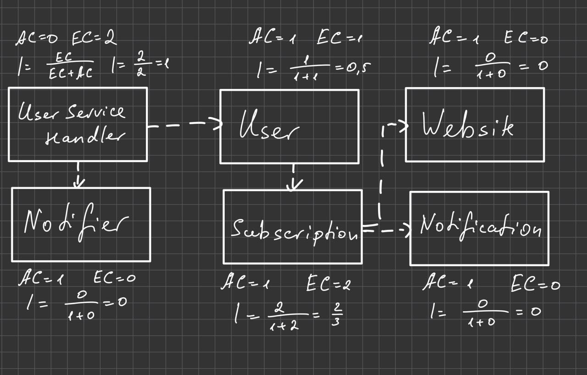
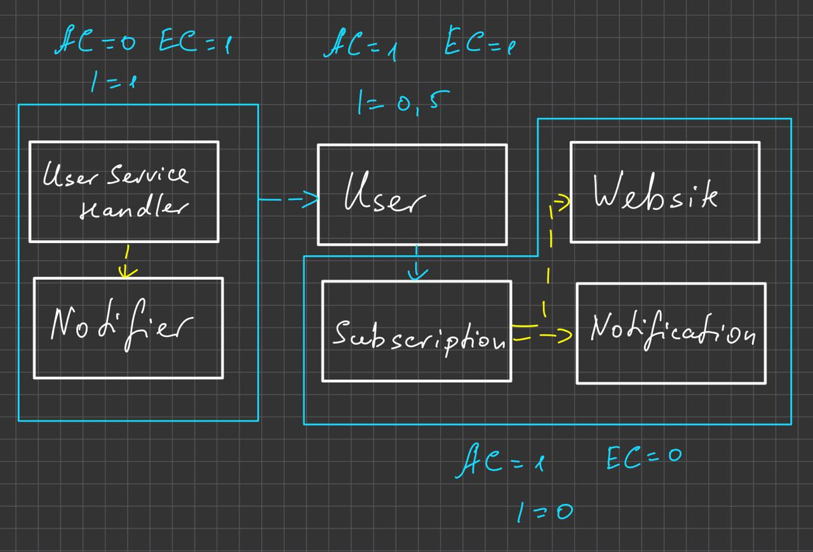

### Implement the system from Exercise 3 task 1 in Java
The code for it is outside the folder, you can run UserServiceHandler and then follow instructions in Terminal.
You have to register first, and then you can add subscriptions and the time in sec how often you would like to be notified in terminal about possible changes.

### Calculate the metrics afferent coupling, efferent coupling and instability for each class. 

### Suggest a package structure for your implementation. 
I would put Subscription.Subscription, Subscription.Subscription.Website and Subscription.Subscription.Subscription.Subscription.Notification in one package, UserServiceHandler and Notifier in other one, and User in separate one.

### Name options to reduce coupling between your packages.
It can be GRASP principle, that we already learned. Or for example Factory/Builder Patterns
