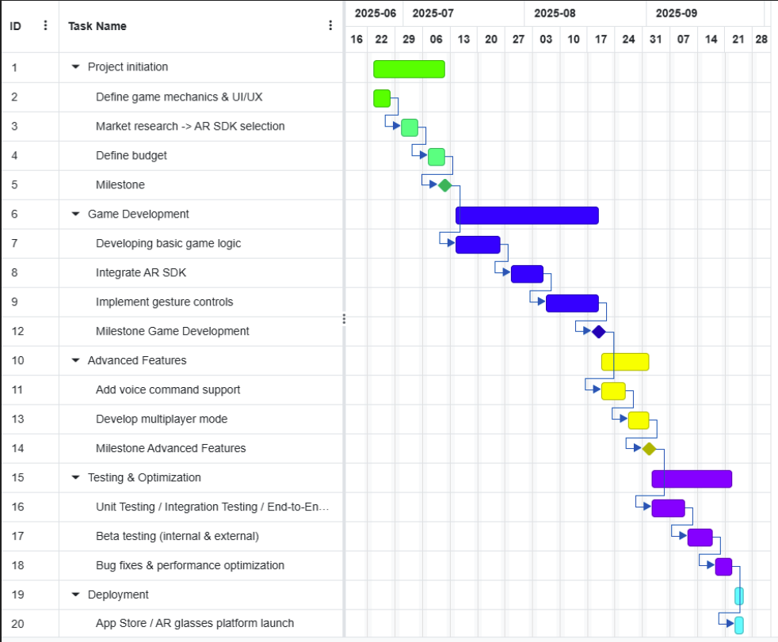

1. Develop a project planning for a Tetris Gaming App for AR glasses. Draw a Gantt
chart with project activities and dependencies. Plan timings and milestones.
gantt chart - 5-10 activities

Milestones:

Project initiation : 
- Market research -> AR SDK selection
- Define game mechanics & UI/UX
- Define budget

Core Game Development:
- Developing basic game logic

AR Integration:
- Integrate AR SDK
- Implement gesture controls

Advanced Features
- Add voice command support
- Develop multiplayer mode

Testing & Optimization:
- Unit Testing / Integration Testing / End-to-End Testing
- Beta testing (internal & external)
- Bug fixes & performance optimization

Deployment
- App Store / AR glasses platform launch

In the gantt chart you can decide weather the task could be parallelized or are they dependent on each other.

Completion grade column to track the result.

The vertical line can indicate the current date to realise where are you in the gantt chart.

2. Estimate the costs of this project and explain your rationale. For which price
   would you sell your software for? Explain why.

#### Freemium:
free version, but for specific  stuff is paid

#### Change Request:
when you have defined requirements and set price, but with any new features product owner creates CR and you will be paid for new feature as well.

#### Cost plus pricing 
You estimate you costs and add margin 
#### Competitive pricing
Price based on the competitive pricing

#### Price elasticity based pricing 
For example : 0,39 * 2M = 800K
               0,99 * 1M = 1M
              6,99 * 0,5M = 3,5M
With diffent price diffent amount of people will buy it

#### Value- base pricing:
if you know the value of your product for the person, you can charge for the value of how much you save the company money 

#### Behavioral pricing:
based on the location, time, targeted audience 

#### AI pricing
#### Development Costs
- AR Developer : $15,000 - $25,000 -> Specialized AR devs charge $50-$100/hr
- Game Developer: $10,000 - $20,000 -> Core gameplay + networking
- UI/UX Designer: $5,000 - $10,000 -> AR interfaces require intuitive design
- Backend: $5,000 - $10,000 -> Firebase or custom backend
- Project Management: $2,000 - $5,000 -> Jira

Total Development Cost	$37,000 - $70,000

#### Additional Costs
- AR Glasses Testing : $2,000 - $5,000 -> Need multiple devices (Meta Quest, HoloLens, etc.)
- Beta Testing: $3,000 - $7,000 -> External testers & debugging
- App Store Fees (Google Play, Apple): $100 - $300/year -> One-time developer fees
- Marketing (Ads, Social Media, Influencers): $5,000 - $20,000 -> Depends on reach
- Legal (Terms, Privacy Policy, Copyright):	$1,000 - $3,000 -> Lawyer fees for compliance

Total Additional Costs	$11,100 - $35,300 

#### Ongoing Costs (Yearly)
- Server Costs -> $1,000 - $5,000/year
- Maintenance (Updates, Bug Fixes) -> $5,000 - $15,000/year
- Marketing  -> $5,000 - $10,000/year

#### Low-End Estimate: ~$50,000

### Pricing Strategy
I would start with a week free trial and then one time purchase One-Time Purchase around $9.99 -> around 5,005 purchases to break even 

And then i would see that the game's becoming popular after breaking even I would switch with the next release  from the one time purchase to subscription plans monthly or yearly pay $3.99/month or $29.99/year.

3. How would you staff the project to achieve the minimal time to market?

### Project Initiation (1-2 weeks): Fast-track research and planning.
#### Team:
- 1 Product Manager (PM) – Oversees market research, budget, and coordinates with stakeholders.
- 1 AR/Game Designer – Handles game mechanics, UI/UX, and AR SDK selection (since expertise overlaps).
- 1 Tech Lead (Part-time) – Advises on SDK feasibility and technical constraints.
Small, senior team avoids overhead
Designer can handle both game design and AR UX.
Tech lead ensures decisions are implementable.

### Core Game Development (2-3 weeks) Build basic Tetris logic quickly.
#### Team:
- 1 Senior Game Developer – Implements core game mechanics (block physics, scoring, etc.).
- 1 Junior Developer (Optional) – Assists with boilerplate code if needed.

Tetris logic is well-defined; a senior dev can build it solo.
Avoid bloating team size to reduce communication overhead.

### AR Integration (2-3 weeks) Integrate AR and gesture controls.
#### Team:
- 1 AR Developer – Works on SDK integration (ARKit/ARCore/Unity MARS).
- 1 Game Developer (from Core Phase) – Collaborates on gesture controls.

AR dev focuses solely on SDK; game dev adapts controls to existing logic.
No need for additional hires—repurpose existing team.

### Advanced Features (2-3 weeks) Add voice + multiplayer without slowing down.
#### Team:
- 1 Backend Developer (Part-time) – Implements multiplayer networking (WebSocket/P2P).
- 1 Game Developer – Adds voice commands (using off-the-shelf APIs like Google ASR). 

Multiplayer is the riskiest feature; a part-time backend specialist keeps costs low.
Voice commands can leverage existing APIs (minimal coding).

### Testing & Optimization (2-3 weeks) Fast but thorough testing.
#### Team:
- 1 QA Engineer – Writes automated tests (unit/integration).
- 1 Developer (Rotating) – Fixes bugs as they’re found.
- 2-3 Internal Beta Testers

Dedicated QA speeds up feedback.
Developers fix issues immediately (no handoff delays).

### Deployment (1 week)
#### Team:
PM + Tech Lead – Handle store submissions (Apple Vision Pro, Meta Quest, etc.).
No additional staff needed.

### Total Team (Peak: 4-5 people)
- 1 Product Manager (full-time)
- 1 AR/Game Designer (full-time)
- 1 Senior Game Developer (full-time)
- 1 AR Developer (full-time during integration)
- 1 Backend Developer (full-time for multiplayer)
- 1 QA Engineer (full-time, ramps up during testing)

4. Which software development process would you use? Explain why.

I would use SCRUM and Kanban.
SCRUM:
- time boxing as sprints and daily

This will ensure frequent communication and regular check in's to avoid surprises 

Kanban:
- Kanban boards can be a huge help to tract the progress of the project and recognize bottlenecks before they will become huge issue. 

5. Your project is already over time and over budget. Describe 5 options to finish the
   project? 

### Cut Non-Essential Features (Scope Reduction)
#### Action:

- Remove low-impact features (e.g., multiplayer mode, voice commands) and ship a minimal viable product (MVP) with just core gameplay + AR gestures.

- Re-prioritize the backlog with stakeholders: "Would you rather have a basic Tetris AR app next month, or wait 3 months for extras?"

*Pros*:

- Fastest way to ship.

- Keeps team morale intact (no layoffs).

*Cons*:

- May disappoint users expecting "full" experience.

### Crunch Mode (Temporary Intensity)
#### Action:

- Extend work hours (e.g., 6-day weeks) for 2–3 weeks to push through remaining tasks.

- Freeze new feature requests and focus only on critical path: AR integration, bug fixes, and store submission.

*Pros*:

- Avoids scope cuts or team changes.

- Short-term sacrifice for on-time delivery.

*Cons*:

- Risk of burnout, bugs, or attrition.

### Add Specialist Contractors (Targeted Help)
#### Action:

- Hire short-term experts for bottleneck areas (e.g., an AR developer to fix gesture lag, a QA engineer to accelerate testing).

- Use fixed-price contracts to control costs.

*Pros*:

- Solves specific problems fast.

- Avoids long-term staffing overhead.

*Cons*:

- Onboarding takes time (1–2 weeks).

- Adds immediate cost (but cheaper than delays).

### Switch Technologies (Radical Simplification)
#### Action:

- Ditch complex dependencies:

- Replace custom AR gestures with head-tap controls (easier to implement).

- Swap native ARKit/ARCore for Unity’s cross-platform AR tools (faster iteration).

*Pros*:

- Could slash dev time by 30–50%.

- Reduces testing overhead.

*Cons*:

- UX trade-offs (e.g., less immersive controls).

### Cancel and Pivot (Strategic Retreat)
#### Action:

- Halt development, document lessons learned, and pivot to:

- A 2D Tetris mobile app (reuse game logic, discard AR).

- A proof-of-concept demo to seek additional funding.

*Pros*:

- Cuts losses early.

- Potentially repurposes work for a simpler product.

*Cons*:

- Sunk cost stigma.

- Team morale hit.
