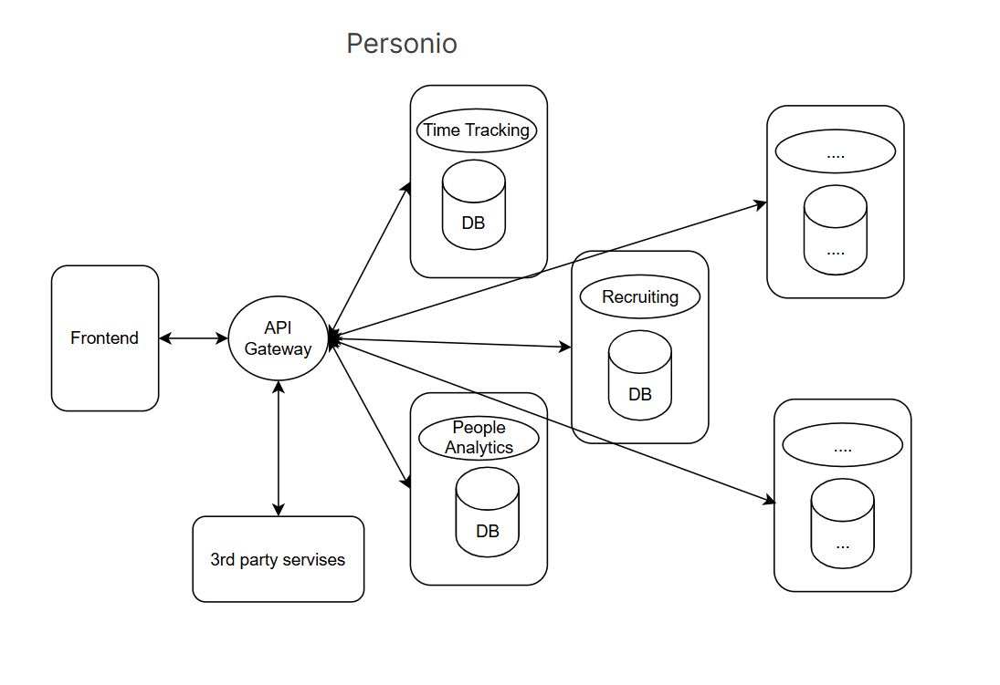

## Exercise 2
Please prepare a written documentation for each task before the exercise date. Repeated
failure to prepare the worksheet may result in not being admitted to the exam. You may
also be asked to present your solution in class.

1. #### Research the SaaS company personio.com. 
- What functionality does its software offer to its clients?
  
*The company develops software that simplifies or automates HR management processes for smaller companies.*

*For example:
Core HR,
Time Tracking,
Absence Management,
People Analytics,
Workflow Automation,
Documents & E-Signature,
Talent Management,
Recruiting,
Workforce Planning,
Performance & Development,
Compensation Management,
Employee Engagement,
Surveys,
Whistleblowing,
Payroll,
Preliminary Payroll*
- Please draw an structural architecture that models this HR software. Think about proper components and interfaces to existing 3rd party services. 

- Describe your architecture and categorise your work within existing architectural styles.

*I would use the microservice architecture, this means that each service is independent and self-contained(loosely coupled). They would interact with each other through the API Gateway. And this way they can be independently developed as well as independently deployed.*
2. Read the paper Yahyavi.pdf pages 1-20 (see CampUAS). Describe this architectural style and compare it to the styles mentioned in the lecture.

*Client-Server Architecture and P2P were mentioned in the lecture, but as this paper in mainly focused on gaming perspective of this architectures, i will include them into the description.(and considering that I wasn't at the lecture, it is a good reminder for myself)*

*1. Client-Server architecture is centralized architecture where a single server maintains the master copies of all game objects and avatars. 
Clients connect to the server to receive updates and send their actions.
The server is responsible for executing updates, resolving conflicts, and disseminating state changes to clients.
On one side it is simple to implement and manage, can ensure strong consistency control.*

*On the other side it has limited scalability (a single server can handle only a few thousand players, sometimes even only few hundred). 
It also has high infrastructure and maintenance costs.
As it isn't that reliable, because of single point of failure (server failure disrupts gameplay).*

*2.Distributed Multi-Server architecture extends the client-server model by distributing the game world across multiple servers.
There is two options to create multi-server architecture:
First one is shards. It is separate instances of the game world, each managed by a dedicated server. Players are isolated to their shard.
Second one is a single game world divided into zones, each managed by a separate server. Players can move between zones.*

*The advantages of the architecture is improved scalability compared to a single-server architecture, better fault tolerance (failure of one server affects only its region/shard).
But it does need hand-off mechanisms for the player movement between regions, and it isolates of players in sharded environments.
Another relevant disadvantage it has high cost of maintaining server farms.*

*3.Peer-to-Peer (P2P) Architecture is fully decentralized architecture where each node (peer) acts as both a client and a server. 
This way game state and computational load are distributed among peers, where they can communicate directly with each other for updates.
This architecture is high scalability, as resources increase as more peers join. It has low infrastructure cost (no need for expensive servers), and potential for low latency (direct peer-to-peer communication).
But among all the architectures we discussed till now it is the most complex one to design and manage.
In the gaming context is also is the most vulnerable one to cheating and it is harder to ensure consistency and control game state.*

*4.Hybrid Architectures combines elements of client-server and P2P architectures.*

There is three variants:
- *Cooperative Message Dissemination servers manage game state, but P2P is used for update dissemination.*

- *State Distribution would describe an architecture where game state is distributed among peers, but servers manage critical operations (e.g., authentication).*

- *Basic Server Control would be where servers handle sensitive data (e.g., login info), while peers manage game state and communication.*

*The most important advantage is the flexibility that this architecture can provide, as well as scalability and control.
But it still requires some centralized components, and we would need to handle the complexity in integrating from P2P and server-based components.*

3. #### Develop illustrations of the 4 architectural views for the system design of a ticket machine used by passengers at a railway station.
*I developed them in drawio, and the resolution would be better if it's open from the file. The link to the drawio file is below.*

https://drive.google.com/file/d/1WIX7i4dUR_-jsKDzNALM21SidxNKzSat/view?usp=sharing
4. #### Suggest an architectural pattern for the following software systems. Why would you recommend this pattern here?

*a) A whistleblowing system on the internet: I would choose publisher-subscriber architecture, because it can notify investigators of new submissions without linking back to whistleblowers.*

*b) A video conferencing system: I would choose client-server architecture, mainly because it would manage room creation, authentication, and media routing through a central server.*

*c) A GPS tracker for cats: It could be either Even-driven architecture or IOT architecture. In even driven one the test point is to get messages(events) where the cat currently is, this would also keep it lightweight.* 

*In IOT architecture it would be implemented the following way: Edge Device (the collar) ➔ Cloud Backend ➔ Mobile/Web Frontend. That means we take the information(GPS location), send it to the cloud storage, and then we can send it to the frontend(mobile app), where the owners could check the location of the cat.*