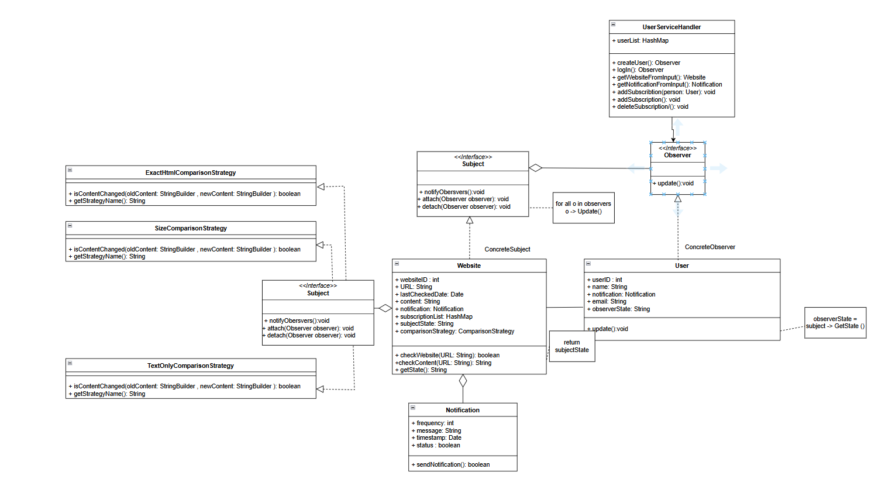

2. Please draw a UML diagram to illustrate the pattern

3. Describe the coding conventions you were using for your software.
   - Naming Conventions(Class names in PascalCase, Method names in camelCase)
   - Structure and Organization(Each class in its own file, Related classes grouped in packages (Comparison package))
   - Method Design(verb-named methods for actions (attach(), detach(), checkContent()))
   - Indentation and Braces(K&R style braces, consistent 4-space indentation)
   - Line Length(Most lines under 80-120 characters)