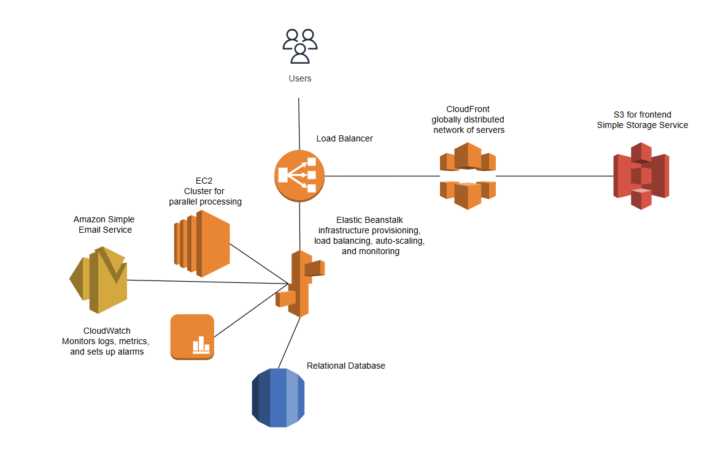

### ***Compare the two computing models mainframe and cloud. Why did it changeover time so dramatically?***

The shift from mainframes to cloud computing happened due to advancements in internet technology, cost efficiency, and scalability needs. Mainframes were expensive and inflexible, while the cloud offered pay-as-you-go pricing, global accessibility, and elastic resources. Additionally, the rise of distributed systems, virtualization, and demand for faster innovation made cloud computing the preferred choice for modern businesses.

Cloud:
- Not owning, but renting
- Rapid elasticity and scalability 
- Pay as you go
- Parallelization

Mainframe:
- Batch Processing 
- Limited Access
- Centralised Data 
- Upfront cost 
### ***Read the paper Varia - Cloud Architectures.pdf pages (see CampUAS). Summarise the advantages of this architectures compared to you implementation from exercise 6.***
1. "Use Scalable Ingredients"
While in my code I use Single-machine execution, in cloud computing it would be massively scalable.
My program would be limited by local resources, and on the other side the cloud computing can be elastic scaled. 

2. Resilient to Reboot and ReLaunch
In my code i have basic error handling; in cloud there is automatic recovery.
I have no built-in redundancy (if the app crashes, state is lost), while cloud ensures message durability and state tracking.

3. Results and Costs
I have only my hardware costs, in cloud i would pay-per-use. 
I would waste resources if my system is idle. But in cloud there would be zero idle cost: Shuts down EC2 instances after job completion.

4. Parallel Processing
In my code no parallelism. In could the program could process millions of documents in parallel.
I have single-threaded content checks. In could it could be multi-node processing.

5. Loose Coupling
In my code i user IObserver pattern, which decouples Website and User. In could SQS queues decouple components (Launch, Monitor, Shutdown).

6. Broad network access 
AWS:
- Amazon S3 acts as an input as well as an output data store.
- Amazon SQS was used as message-passing mechanism between components. It also  acts as a transient buffer between two components (controllers).
- Amazon SimpleDB is used as a status database to store the different states of the components and a historical/log database for querying high performance data.
- Hadoop is an open source distributed processing
  framework that allows computation of large datasets by
  splitting the dataset into manageable chunks, spreading
  it across a fleet of machines and managing the overall
  process by launching jobs, processing the job no matter
  where the data is physically located and, at the end,
  aggregating the job output into a final result.
### ***How would you redesign you application using the mentioned cloud services. Draw a reiterated cloud architecture for your application***

Redesigned System
Amazon S3	Stores website contents and update.
Amazon EC2	Runs a Hadoop cluster for parallel website checks.
Amazon SimpleDB	Tracks job status, comparison strategy, notification preferences, URL

A user provides a URL, comparison strategy, and notification preferences. This data is stored in SimpleDB, and a job request is queued in SQS.

